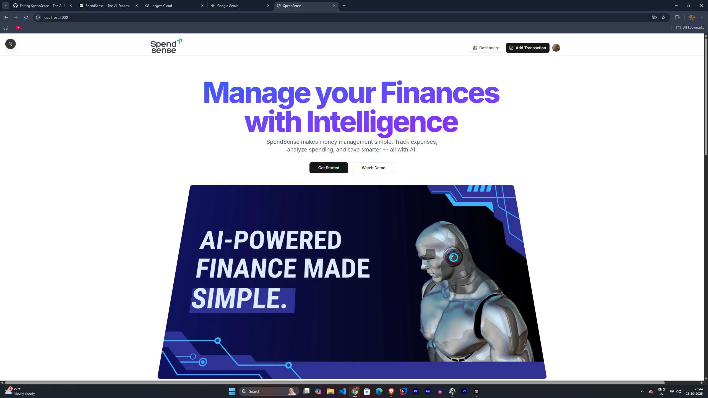
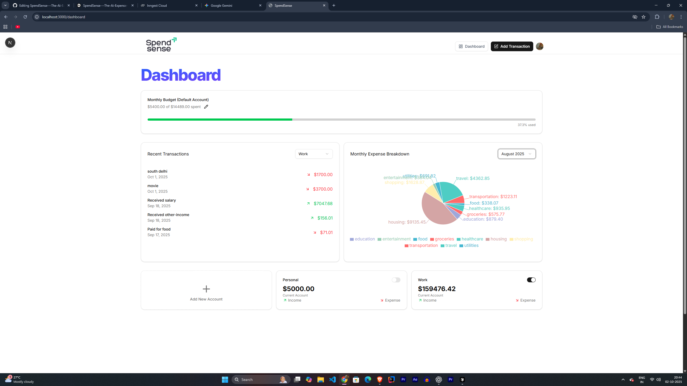
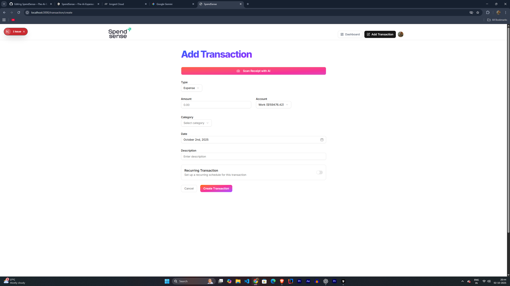

# 💸 SpendSense – AI Expense Tracker  

> An intelligent **personal finance management** web app powered by **Next.js, React, Clerk, and ArcJet**.  
Track expenses, manage accounts, and gain AI-driven insights — all in one place.  

## ✨ Features  

- 🤖 **AI-Powered Insights** – Predict spending patterns & auto-categorize expenses  
- 🔐 **Clerk Authentication** – Secure login & registration  
- 💳 **Expense Tracking** – Add, edit, view transactions across accounts  
- 🏦 **Account Management** – Manage multiple accounts with ease  
- 📊 **Real-Time Reports** – Charts & visual summaries  
- 🛡 **ArcJet Bot Protection** – Keep bots & abuse away  
- 📱 **Responsive UI** – Works on desktop & mobile  
- 📧 **Email Notifications** – Reports & alerts via **Resend**  

---

## 🛠 Tech Stack  

<p align="center">
  
  
  
  
  
  
  
  
  
  
  
  
  
  
  
  
</p>

---

## 🚀 Getting Started  

<details>
  <summary><b>📥 Installation</b></summary>

```bash
# Clone the repository
git clone https://github.com/Deepakkumar2387/SpendSense---The-Ai-Expense-Tracker-.git
cd spendsense

# Install dependencies
npm install
# or
yarn install

Create a .env file in the root directory:

NEXT_PUBLIC_CLERK_FRONTEND_API=<your-clerk-frontend-api>
CLERK_API_KEY=<your-clerk-backend-api>
ARCJET_KEY=<your-arcjet-key>
DATABASE_URL=<your-database-url>

npm run dev
# or
yarn dev


Now open 👉 http://localhost:3000


📂 Project Structure
SpendSense/
│
├─ app/                # Next.js App directory
│   ├─ (main)/         # Main pages
│   ├─ middleware.ts   # ArcJet + Clerk middleware
│   └─ _components/    # Reusable components
│
├─ lib/                # Helper functions
├─ prisma/             # Prisma schema & migrations
├─ public/             # Static assets
├─ components/         # React components
├─ package.json
└─ README.md

📖 Usage

🔑 Login / Register with Clerk

💳 Add accounts & transactions

📊 View AI-powered insights & reports

📧 Receive alerts via email

🚀 Deployment

Push your project to GitHub

Import into Vercel

Set environment variables in Vercel dashboard

Hit Deploy! 🎉

🤝 Contributing

🍴 Fork the repository

🌿 Create your branch

💾 Commit changes

🚀 Push & Open PR


## Deployment
Deployed on Railway: https://spendsense-the-ai-expense-tracker-production.up.railway.app/


🏷 About

SpendSense – For anyone who wants to manage money smartly with AI.







